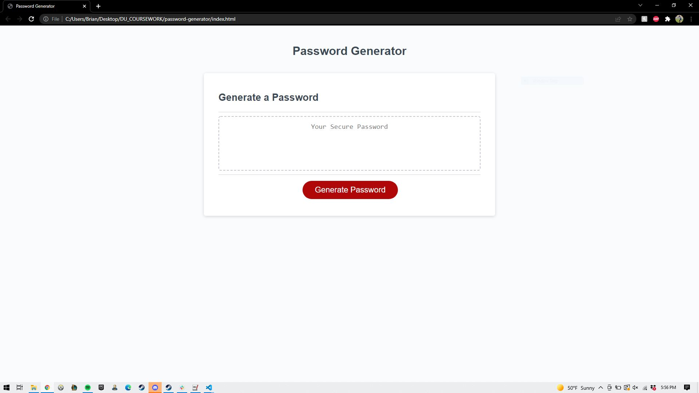
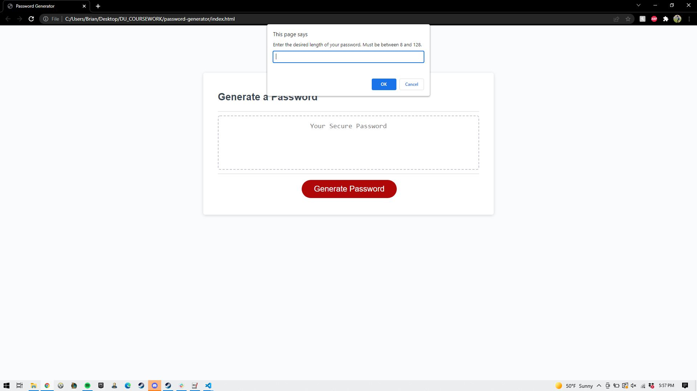
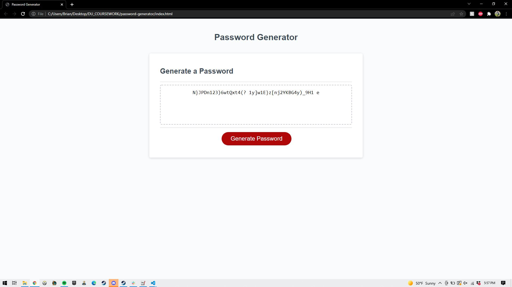

# Password generator

* When generate button is clicked, the site uses prompt() and confirm() to acquire desired password criteria.
* User criteria then used to generate random password including only the character types specified.
* Generated password is then rendered on screen using the #password \<textarea\> tag.

